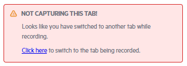
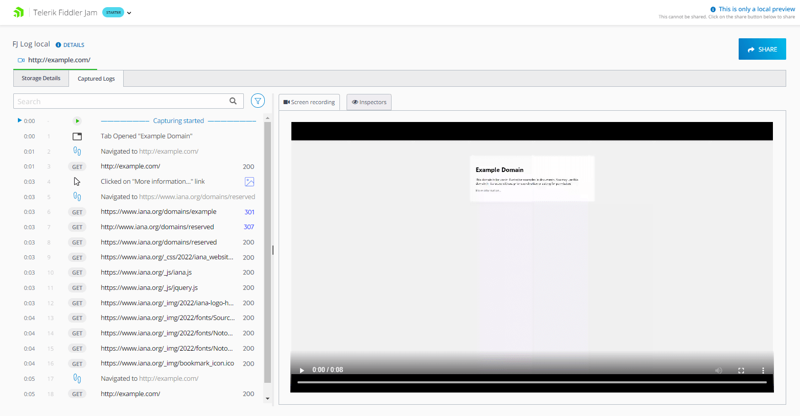

# First Steps with the Fiddler Jam Chrome Extension

This tutorial describes installing and starting using the Fiddler Jam Chrome Extension.

- First, you will install the lightweight Fiddler Jam Chrome Extension.

- Next, you'll record a network request and then save it.

- Finally, you will share the issue through the link automatically generated when you upload the log to the Fiddler Jam Portal cloud space.  

The following video demonstrates the essential steps from this guide by showing how to install the Fiddler Jam Chrome Extension from the [Google Chrome Web Store](https://chrome.google.com/webstore/detail/fiddler-jam/fnkjlegmkbicdodlheligomlfbdblpfj).

<iframe width="853" height="480" src="https://www.youtube.com/embed/AegKWavRSv0" title="YouTube video player" frameborder="0" allow="accelerometer; autoplay; clipboard-write; encrypted-media; gyroscope; picture-in-picture" allowfullscreen></iframe>

## Prerequisites

* Install the Chrome browser on your machine.

* Provide an active Internet connection with access to the following URLs:

    ```curl
      https://*.getfiddler.com/
      https://*.amazonaws.com/
    ```

## Installing the Extension

You'll first add the Fiddler Jam Chrome Extension. Before starting, make sure you are not browsing as a guest or in Incognito mode.

1. Open the Google Chrome browser on your computer.

1. Open the [**Chrome Web Store** page for Fiddler Jam](https://chrome.google.com/webstore/detail/fiddler-jam/fnkjlegmkbicdodlheligomlfbdblpfj).

1. Click **Add to Chrome**.

1. In the confirmation popup, click **Add extension**.

After successfully installing the Extension, you can [change the site access and enable the Extension to work in the Incognito mode]().

>tip Microsoft Edge users can pull the Fiddler Jam extension from either [Microsoft's own Edge Add-ons](https://microsoftedge.microsoft.com/addons/detail/fiddler-jam/fpolpgbhhhbioobffnkcfhmdafkgcmbh), or the [Google Chrome Web Store](https://chrome.google.com/webstore/detail/fiddler-jam/fnkjlegmkbicdodlheligomlfbdblpfj).

## Pinning the Extension

For quicker and easier access, now pin the Extension:

1. Click the **Extensions** button on the Google Chrome toolbar next to your profile avatar.

1. Click the pin next to the **Fiddler Jam** extension.


## Recording a Log

In this step, you'll record a captured traffic session to isolate a network issue and then be able to share it with the engineering teams for further analysis.  

1. Open a new browser tab where the capturing will take place.

1. Click the  or use the keyboard shortcuts **Ctrl** + **Shift** + **H** (Windows) or **Cmd** + **Shift** + **H** (macOS) to launch the Fiddler Jam extension. 
    
    If you expand [**Advanced Options**](), you'll see that some of the settings are enabled or disabled by default. Let's not change any of them for this guide and work with the default ones.

1. (**Optional**) Click the user icon at the top-right corner of the extension to log in with your account. Alternatively, you can directly use the extension anonymously, but [you will miss some of the management options](#extension-login).       

1. Click **Start Capture** to start recording.

    As a result, Fiddler Jam initiates the recording of all network activity in the current browser tab, and a notification appears informing you that Fiddler Jam has started debugging. Close the notification or click **Cancel** safely as these won't stop the capturing. Hide the Fiddler Jam window by clicking anywhere in the browser tab, and continue recording. Try not to exceed the maximum size of a recorded of 100MB.

    

1. Enter the URL in the browser address bar. Note that Fiddler Jam captures the traffic only from the tab which initially started the recording. The extension provides an informational warning if you open a new browser tab during a continuous recording. 

    

1. When the issue has been captured, click **Stop Capture** to end the recording.

1. Let's now preview the recorded log&mdash;click the **Preview** button. The captured session loads as a local preview in a new browser tab. This preview can't be shared.

   

1. After reviewing the record, go back to the extension.


## Submitting the Log

At this point, the captured traffic is recorded as a log but is not yet submitted and saved in the Fiddler Jam Portal cloud space. Now let's use the generated link to share the issue with the engineering teams for troubleshooting and analysis.

1. Go to [**Sharing options**]() and set the access level for the recorded log.

    Here you have an option to make the log public or share it with specific people, and also, you can protect the log with a password. However, for demonstration purposes, let's make the log public and not use a password.

1. Create a public link by selecting [**Share with link**](#sharing-the-generated-link) and clicking **Get Link**. The generated link points to the Fiddler Jam Portal cloud space, containing the submitted log. This URL is accessible only for Fiddler Jam Portal users.

    Like the previous step options, here you have the [**Share with specific people**](#sharing-the-log-with-specific-people) option, which will create a link only for the Fiddler Portal users who are explicitly added to the Portal with their account emails.

    The option [**Upload to a workspace**](#upload-to-jam-portal-workspace)  is available only for authenticated Fiddler Jam [**portal** users](#portal-users). This functionality allows a portal user to add the captured log in an existing workspace directly.

    

1. Click **Copy Link** to store the unique URL to the clipboard and paste this link to share the recorded logs with the Fiddler Jam Portal users.

    All submitted logs are private and accessible for Fiddler Jam Portal users with the proper access rights. Authenticated Fiddler Jam users can manage their recorded logs through the [**My Captures**](#my-captures) section.

   

That was it! Now you are ready to dive more deeply into Fiddler Jam Chrome Extension and take full advantage of its slick functionalities!

## Next Steps

* [Managing the Chrome Extension after Its Installation]()
* [Advanced Capturing Options]()
* [Log Sharing Options]()
* [Error Handling]()
