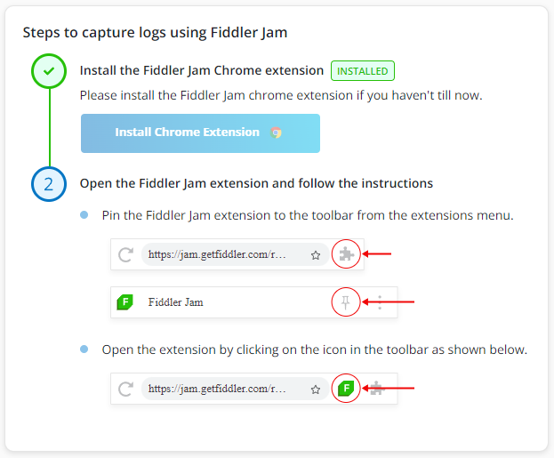

# Using Prerecorded Link

This tutorial describes how to use Fiddler Jam prerecorded link.

- First, you will install the lightweight Fiddler Jam Chrome Extension.

- Next, you'll use the received Jam prerecorded link to record a network request.

- Finally, you will submit the issue to the Fiddler Jam Portal cloud space, where the prerecorded link creator can further investigate your case.  

## Recording a Log

In this step, you'll record a captured traffic session so that you can isolate a network issue and then be able to share it with the engineering teams for further analysis.  

1. Open the prerecorded Jam link shared with you by your collaborator (support agent, developer, etc.).

    

1. Open the Fiddler Jam extension 

    At this point, if you expand [**Advanced Options**](), you'll see that some of the settings are enabled or disabled by default. Let's not change any of them for this guide and work with the default ones.

1. Click **Start Capture** to start recording.

    As a result, Fiddler Jam initiates the recording of all network activity in the current browser tab, and a notification appears informing you that Fiddler Jam has started debugging. Close the notification or click **Cancel** safely as these won't stop the capturing. Hide the Fiddler Jam window by clicking anywhere in the browser tab, and continue recording. Try not to exceed the maximum size of a recorded of 50MB.

    

1. Enter the URL in the browser address bar. If the creator of the prerecorded link has set a default URL, it will be loaded

1. When the issue has been captured, click **Stop Capture** to end the recording.

    

1. Let's now preview the recorded log&mdash;click the **Preview** button. The captured session loads as a local preview in a new browser tab. This preview can't be shared.

1. After reviewing the record, go back to the extension.

1. Click **Submit Logs** to immediately share the recorded logs with the Fiddler Jam Portal user that created the4 prerecorded link.

    All submitted logs are private and accessible for Fiddler Jam Portal users with the proper access rights. Additionally, each record can use password-protection before its submission.

    

That was it! Now your logs are submitted in the Jam cloud space, and your Fiddler Jam portal agent can start deep-diving into its details.