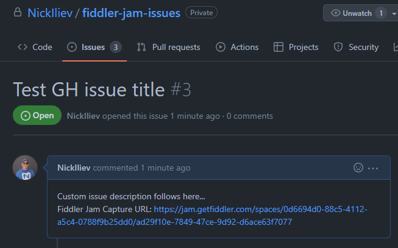
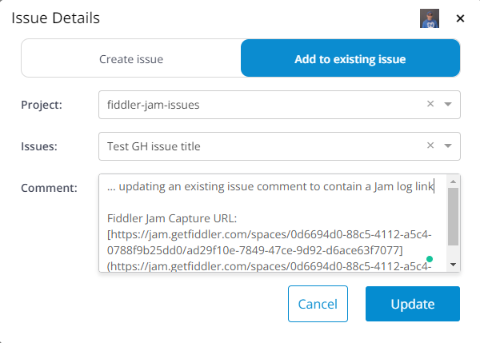
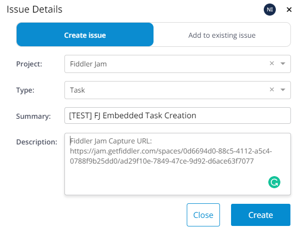
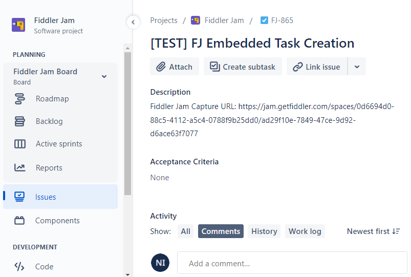
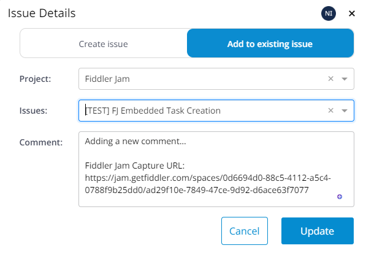
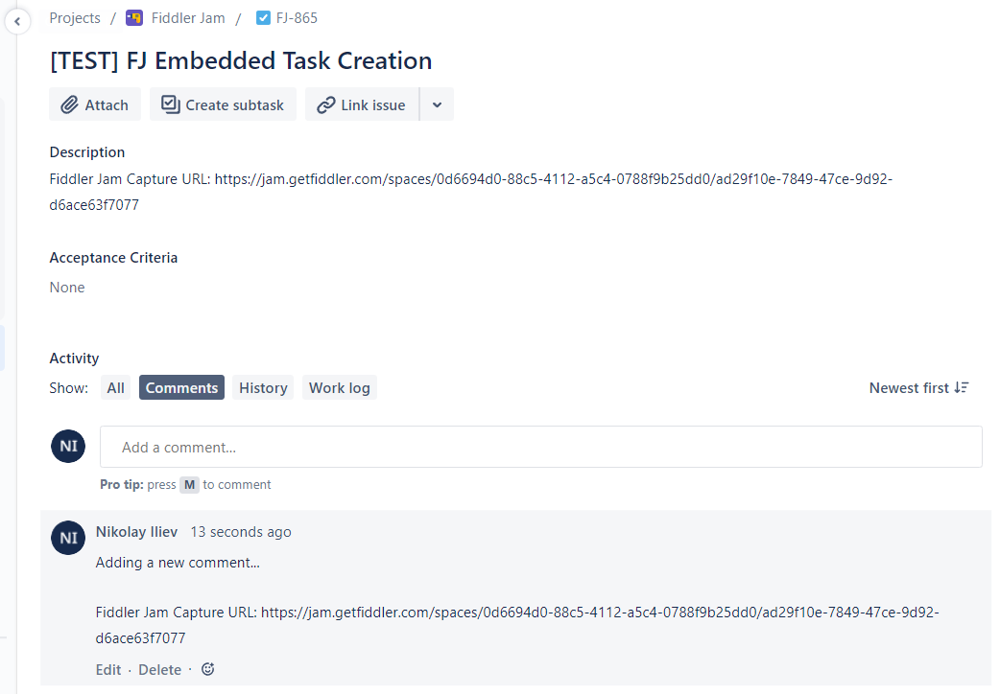
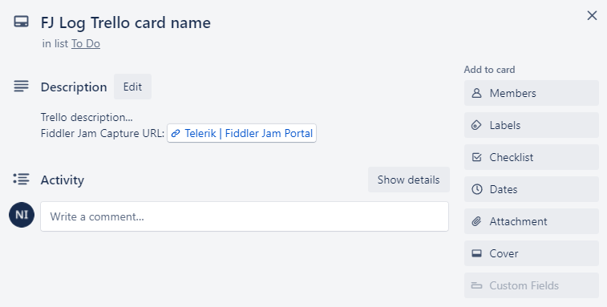
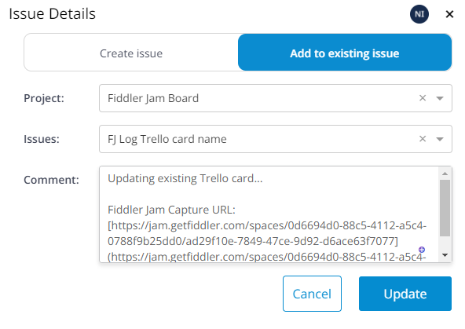
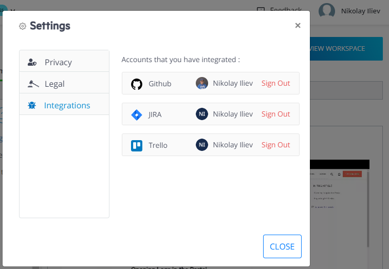

# Third-Party Integrations

You can link all Jam logs which are added to and are part of a portal workspace to third-party tracking solutions. 

Currently, the Jam portal supports integrations with the following services:

- [GitHub](https://github.com/) issues.

- [Jira](https://www.atlassian.com/software/jira) projects.

- [Trello](https://trello.com/en) boards.

## Linking Jam Logs to GitHub Issues

You can link a Jam log to a new GitHub issue or add it to an existing one. 

### Linking a Log to a New GitHub Issue

To link a Jam log to a new GitHub issue:

1. Use the integration button from the main log menu in the top-right corner to link a log to a selected third-party tracking solution. 

    __Integration options from the main log menu__
    
    

1. Click the **GitHub** option. If you use GitHub integrations for the first time, you may be asked to authorize.

1. Choose the **Create Issue** tab to create an entirely new GitHub issue.

    3.1 Select the GitHub project where the issue will reside.
    3.2 Add a summary (corresponds to GitHub issue title).
    3.3 Add a description (corresponds to GitHub issue comment). By default, the description contains a quick link to the Fiddler Jam log.

    __Create a new GitHub issue__

    

1. Click the **Create** button to finalize the GitHub issue creation. As a result, the newly created GitHub issue is immediately accessible.

    __An example of a newly created GitHub issue__

    

### Adding a Log to an Existing GitHub Issue

To add a Jam log and comment to an existing GitHub issue:

1. Use the integration button from the main log menu in the top-right corner to link a log to a selected third-party tracking solution. 

    __Integration options from the main log menu__

    

1. Click the **GitHub** option. If you use GitHub integrations for the first time, you may be asked to authorize.

1. Choose the **Add to Existing Issue** tab to add a comment to an already existing GitHub issue.

    3.1 Select the GitHub project where the issue resides.
    3.2 Select a GitHub issue from the drop-down.
    3.3 Add a comment (corresponds to a new GitHub issue comment). The comment contains a quick link to the Fiddler Jam log by default.

    __The Add to Existing Issue GitHub option__

    

1. Click the **Update** button to add the new comment to the existing GitHub issue. As a result, the updated GitHub issue is immediately accessible.

    __An example for an updated GitHub issue__

    

### Linked Log GitHub Options

You can log a portal log only to a single tracking system. Once a log is linked, use the integration button from the main log menu in the top-right corner for a quick link to the GitHub issue (through the **Open in GitHub** option) or to unlink the log (through the **Unlink log from GitHub** option). Note that unlinking a log won't change the GitHub issue.

__Linked Log GitHub options__

## Linking Jam Logs to Jira Issues

You can link a Jam log to a new Jira issue or add it to an existing one. 

## Linking a Log to a New Jira Issue

To link a Jam log to a new Jira issue:

1. Use the integration button from the main log menu in the top-right corner to link a log to the selected third-party tracking solution. 

    __Integration options from the main log menu__

    

1. Click the **JIRA** option. If you use Jira integrations for the first time, you may be asked to authorize.

1. Choose the **Create Issue** tab to create an entirely new Jira issue.

    3.1 Select the Jira project where the issue will reside.
    3.2 Select the Jira issue type from the drop-down menu by specifying a **Task**, **Bug**, **Story**, or other project issue types.
    3.3 Add a summary (corresponds to Jira issue title).
    3.4 Add a description (corresponds to Jira issue description). The description contains a quick link to the Fiddler Jam log by default.

    __Create a new Jira issue__

    

1. Click the **Create** button to finalize the Jira issue creation. As a result, the newly created Jira issue is immediately accessible.

    __An example of a newly created Jira issue__

    

### Adding a Log to an Existing Jira Issue

To add a Jam log and comment to an existing Jira issue:

1. Use the integration button from the main log menu in the top-right corner to link a log to the selected third-party tracking solution. 

    __Integration options from the main log menu__

    

1. Click the **JIRA** option. If you use Jira integrations for the first time, you may be asked to authorize.

1. Choose the **Add to Existing Issue** tab to add a comment to an already existing Jira issue.

    3.1 Select the Jira project where the issue resides.
    3.2 Select a Jira issue from the drop-down menu.
    3.3 Add a comment (corresponds to a new Jira issue comment). The comment contains a quick link to the Fiddler Jam log by default.

    __Add a log to an existing Jira issue__

    

1. Click the **Update** button to add the new comment to the existing Jira issue. As a result, the updated Jira issue is immediately accessible.

    __An example of an updated Jira issue__

    

### Linked Log Jira Options

You can log a portal log only to a single tracking system. Once a log is linked, use the integration button from the main log menu in the top-right corner for a quick link to the Jira issue (through the **Open in Jira** option) or to unlink the log (through the **Unlink log from Jira** option). Note that unlinking a log won't change the existing Jira issue.

_Linked Log Jira options_

## Linking Logs to Trello Tasks

You can link a Jam log to a new Trello task or add it to an existing one. 

### Linking a Log to a New Trello Task

To link a Jam log to a new Trello task:

1. Use the integration button from the main log menu in the top-right corner to link a log to the selected third-party tracking solution. 

    __Integration options from the main log menu__

    

1. Click the **Trello** option. If you use Trello integrations for the first time, you may be asked to authorize.

1. Choose the **Create Issue** tab to create an entirely new Trello task.

    3.1 Select the project (corresponds to Trello board) where the task will reside.
    3.2 Select the Trello list type from the drop-down menu (for example, **ToDo**, **Doing**, **Done**, or other board list types).
    3.3 Add a summary (corresponds to Trello task title).
    3.4 Add a description (corresponds to Trello task description). The description contains a quick link to the Fiddler Jam log by default.

    __Create a new Trello task__

    

1. Click the **Create** button to finalize the Trello task creation. As a result, the newly created Trello task is immediately accessible.

    __An example of a newly created Trello task__

    

### Adding a Log to an Existing Trello Task

To add a Jam log and comment to an existing Trello task:

1. Use the integration button from the main log menu in the top-right corner to link a log to the selected third-party tracking solution. 

    __Integration options from the main log menu__

    

1. Click the **Trello** option. If you use Trello integrations for the first time, you may be asked to authorize.

1. Choose the **Add to Existing Issue** tab to add a comment to an already existing Trello task.

    3.1 Select the project (corresponds to Trello board) where the task resides.
    3.2 Select the existing Trello task from the drop-down.
    3.3 Add a comment (corresponds to a new Trello task comment). The comment contains a quick link to the Fiddler Jam log by default.

    __Add to an existing Trello task__

    

1. Click the **Update** button to add the new comment to the existing Trello task. As a result, the updated Trello task is immediately accessible.

    __An example of an updated Trello task__

    

### Linked Log Trello Options

A portal log can be linked only to a single tracking system. Once a log is linked, use the integration button from the main log menu (top-right corner) for a quick link to the Trello task (through the **Open in Trello** option) or to unlink the log (through the **Unlink log from Trello** option). Note that unlinking a log won't change the existing Trello task.

__Linked Log Trello options__

## Signing Out 

Once an integration service is authorized, Fiddler Jam will keep you logged in. You can explicitly sign out from the selected service through the **Integration** section in the user **Settings** menu, that is, the user icon in the top-right corner of the Fiddler Jam portal.

__Integrations settings__

