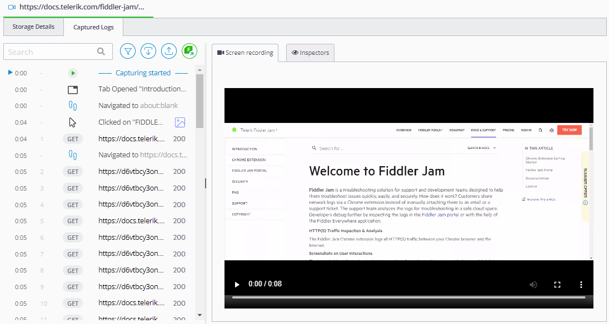
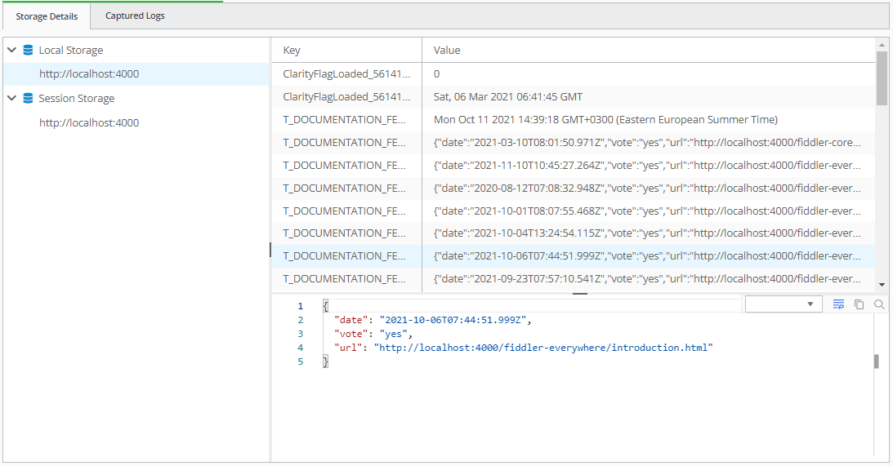

# Submitted Logs

A Fiddler Jam log is a piece of information recorded by Extension users with the Fiddler Jam Chrome Extension. A log contains the captured network traffic and (optionally) the generated console logs and screenshots from the user interaction. The maximum size for a Fiddler Jam log, including requests and screenshots, is 100MB.

The access to the log details depends on the link generation options selected by the Extension User.

* Public links are accessible for any Fiddler Jam Portal user.
* Links generated through the **Share with specific people** option are accessible only for the specified Fiddler Jam Portal users.
* Links generated with the **password-protection** option are accessible for Fiddler Jam Portal users aware of the password.

Once [an Extension User](#extension-users) submits recorded traffic, the log uploads to the Fiddler Jam Portal cloud space. The Fiddler Jam Portal keeps any submitted logs in the storage for 31 days. After that period, if the log is not added to [a workspace](), it will be automatically deleted.

In the Fiddler Jam Portal, any [Portal User](#user-role) with access rights can save, organize, analyze, and work with the provided records.

## Opening Submitted Logs

When the Extension User submits the log, it is automatically uploaded to the Fiddler Jam Portal cloud space. The Extension User is the only one to know the exact address of the log and shares the generated link for the logged recording with the engineering teams who are Portal Users with the respective Portal access rights.

Fiddler Jam protects the content of the submitted logs through the following rules:

- All logs are captured with applied masking for [any data Fiddler considers is sensitive](#masking-sensitive-data).

- The submitted log can be opened only by Portal Users who meet the access rights requirements that the Extension User set through [the link generation options]()).

- The submitted log can be added to a workspace by Portal Users with the respective access rights. Any log that is not added to a workspace will be automatically deleted after 31 days.

To enable a [Portal Viewer](#viewer-role) to open the submitted log:

1. The Extension User must set the appropriate access rights during the link generation.

1. The Portal User must add the log to a workspace.

## Options for Working with Logs

Once a submitted log gets uploaded to the Fiddler Jam Portal, the Portal provides the following options for managing that log:

- [Using and editing the log details](#log-details) such as its title, description, and so on.

- [Investigating the captured data of the requests and responses](#traffic-inspection)&mdash;The session data includes the headers and bodies of each HTTP or HTTPS request and response.

- [Inspecting the browser events](#browser-events)&mdash;Each log contains the browser events triggered from user interactions with the page during the recording.

- [Inspecting the taken screenshots](#screenshot-inspection)&mdash;When the Extension User explicitly enables the screenshot option, a new screenshot is added for each user interaction on a clickable element.

- [Inspecting the screen recording](#screen-recording)&mdash;When the Extension User explicitly enables the **Capture video** option, the whole capturing process is output in the **Screen Recording** tab.

- [Analyzing the developer console logs](#console-log-inspection), which is available when the Extension User has selected the **Capture console** option.

- [Running an advanced investigation through the Fiddler Everywhere web-debugging tool](#fiddler-everywhere-integration).

- [Exporting the captured data as a HAR file](#export-har).

- [Adding submitted logs to desired organizational workspaces](#Aadd-submitted-log-to-workspace).

The capture options of the Fiddler Jam Chrome Extension also provide features for you to mask sensitive data, such as cookies and post-data, and disable the browser cache.

## Available Tabs and Inspectors

To debug and investigate in detail any reported issue, you can use the Fiddler Jam Portal tabs and inspectors.

Each log contains a list of entries containing different recorded information such as HTTP and HTTPS sessions, console logs, screenshots, browser events, etc.

The **Log** page in the Fiddler Jam Portal displays the **Storage Details** and **Captured Logs** primary tabs on the left, and **Screen Recording** and **Inspectors** primary tabs on the right.

- **Storage Details** contains lists of the entries stored in the **Local Storage** and the **Session Storage**. The tab renders data only when the Extension User has explicitly used the **Capture storage info** from the [**Advanced options**]().

- **Captured Logs** contains a numerated list of the captured HTTP and HTTPS sessions, screenshots, browser events, and console logs.

- **Screen Recording** contains a screen recording from the browser, which the Fiddler Jam Chrome Extension took during the recording. The tab renders data only when the Extension User has explicitly used the **Capture video** from the [**Advanced options**]().

- **Inspectors** shows an inspector that loads the information for the selected line from the **Captured Logs** list. Depending on whether you choose an HTTP session, a console log, or a browser event, the inspectors change. For example, Fiddler Jam loads the **Request** and **Response** inspectors when you select an HTTP session, displays the **Console Log Details** screen when you select a console log entry, and a **Browser Event Information** inspector when you select a browser event entry.

### Inspecting Traffic

To investigate a specific HTTP or HTTPS session:

1. Open the submitted log.

1. (Optional) Filter by a search term if using the **Search** text field, or filter by the log type if using the **Filter** button.

    Each captured HTTP or HTTPS session has a unique **ID** line that can be used as a reference in both the Fiddler Jam Portal and the Fiddler Everywhere desktop application.

1. Select a session line from the **Captured Logs** tab.

    - When the selected line is an HTTP session, the **Request** and **Response** inspectors load the session content (headers, body, cookies, and so on). Note that depending on [the capture options](), some of the submitted information might be masked.
    - When the selected line is user interaction, the inspector will load technical details about the action&mdash;for example, the HTML tag, the text value, and the name of the specific action.
    - When the selected line is a screenshot of user interaction, a preview inspector will load the taken screenshot depicting the moment of the user interaction alongside the technical data about that action.
    - When the selected line is a console log, a details inspector will load the log details and the captured stack trace.

### Inspecting Browser Events

Each log contains browser events that are triggered by user interaction. Each event stores additional information about the date and time it occurred and the specific technical data associated with the event. Additionally, the `click` events contain a screenshot with an action pointer.

Fiddler tracks the following events:
- **click**
- **double-click**
- **navigated to**
- **tab opened**
- **tab closed**
- pressed **`Enter`** key
- pressed **`Tab`** key
- pressed **`Esc`** key
- pressed any of **the arrows keys** (up,down,left, and right)
- pressed **page up** or **page down** keys (`Fn` + `UP` arrow, and `Fn` + `Down` arrow on Mac)
- pressed **`End`** key
- pressed **`Home`** key
- pressed **`Space`** key
- pressed **`Insert`** key
- pressed **`Delete`** key
- pressed **`Backspace`** key
- pressed any of **Function** keys (F1 - F15) 
- **scroll**
- **text-input** (only the event without the actual inputted data)

When **Capture screenshots** is explicitly enabled, the log will also contain screenshots for the **click** and **double-click** events.

To examine a screenshot:

1. From the **Captured Logs** list, select [a **Click** event line](#browser-events). The associated screenshot loads in the **Inspectors** tab as the last property of the event data.

1. Use the **Save** icon to download the screenshot as a PNG file locally.

The following figure demonstrates a captured click action.

### Inspecting Console Logs

A log will also contain console log lines if the Extension User has explicitly enabled the capturing of developer console logs. To load the desired console log in the **Inspectors** tab, select a console log line from the **Captured Logs** list. The inspector displays the time the log was output and the log stack trace content.

The following example demonstrates a captured console log.

### Inspecting Video Recordings

When the Extension User explicitly enables video recording, the whole capturing in the initial tab is output in a video recording. To load the video, use the **Screen recording** tab to the right.

The following example demonstrates a captured screen recording.

### Inspecting Storage Details

The **Storage Details** tab to the left displays the **Local Storage** and **Session Storage** data.

The following example demonstrates captured storage data.

## User Interface of the Log Dashboard

Apart from the recorded data, each log also contains user-defined log details such as the log title, description, field submission, and the workspace. Every log also contains an immutable [**Details**](#details) tab, storing technical and environmental data extracted from the Extension.

### Log Details

To add or edit the log details of a newly submitted log:

1. Open the submitted log and click **Add to Workspace**.

1. In the prompted window, edit the desired log details (**title**, **description**, **submitted by**, **workspace**).

1. When ready to add the log with the updated details to the selected workspace, click **Done**.

To edit the details of a log that is already added to a workspace:

1. Open the submitted log from the workspace.

1. Click the **Edit Log Details** icon in the top-right corner next to **Open Workspace**.

1. Edit the **title**, **description**, and **submitted by** fields.

1. Click **Done**.

### Details

The expandable **Details** window, located to the right of the log title, shows the technical and environmental data extracted from the Extension. That data includes information about the URL, time, OS, browser, screen resolution, used localization, timestamps, Extension version, and the enabled Extension [capture options]().

### Tabs and Inspectors

Each log loads to a screen with different tabs, and [each tab has its conceptual inspectors](#tabs-and-inspectors).

### Search and Filters

A log can contain an excessive number of recorded HTTP requests, browser events, such as mouse interactions and navigation events, screenshots, console logs, and so on.

Use the **Search** field in the **Captured Logs** tab to filter the entries based on a custom search term. To filter the log entries, such as requests, screenshots, browser events, and console logs, use the **Filters** icon next to the **Search** text input.

### Download HAR

A submitted log can be exported as an HTTP Archive format (HAR) file. A HAR file is a JSON-formatted archive file format for logging a web browser interaction with a site and is subsequently used with any third-party software that supports the HAR format.

To download the log as a HAR file, use the **Download HAR File** button next to the **Filters** icon.

Any submitted log can also be reloaded in the Fiddler Jam Chrome Extension for a mock replay. To load the log in the Chrome Extension, use the **Load HAR for mocking** button.

### Fiddler Everywhere Integration

The standalone Fiddler Everywhere application can load Fiddler Jam logs for further deep-dive investigation. Refer to the [official Fiddler Everywhere and its cross-platform functionalities](https://docs.telerik.com/fiddler-everywhere/introduction).

### Copy URL

A submitted log can be shared again through the **Copy URL** button, located in the top-right corner next to the **Submitted by**.
