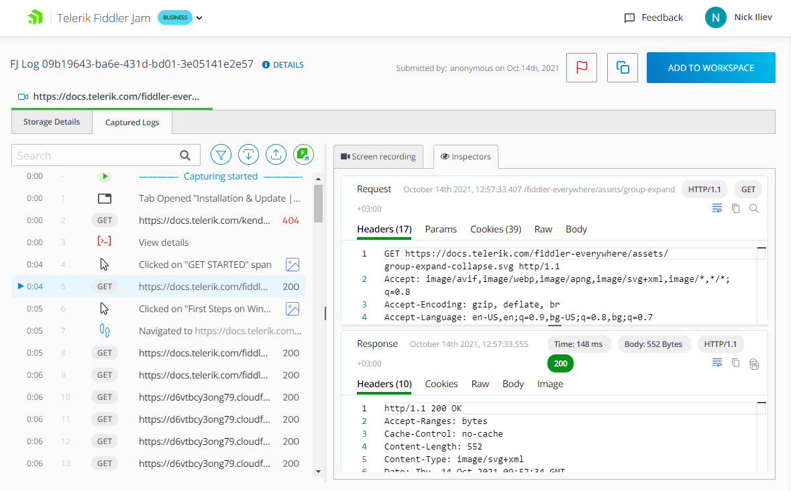
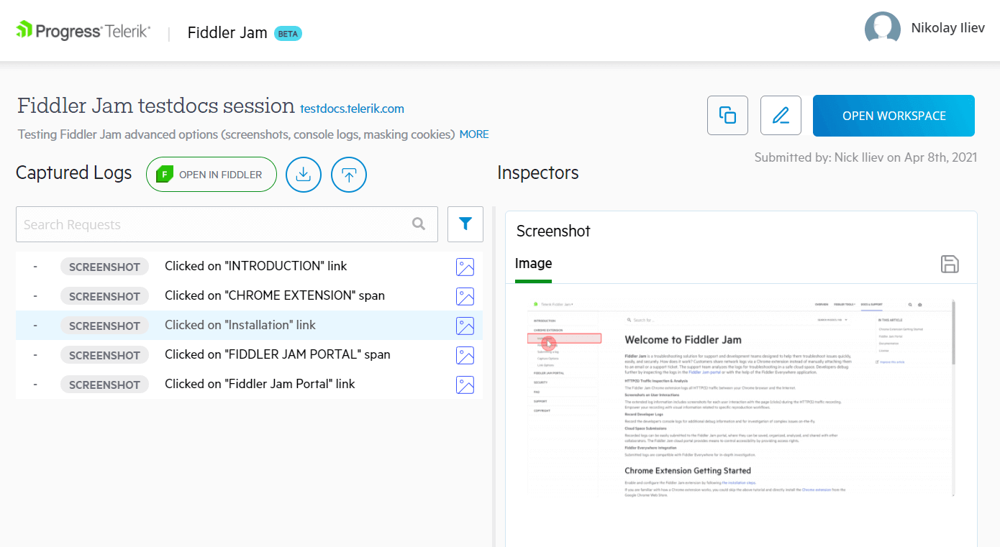
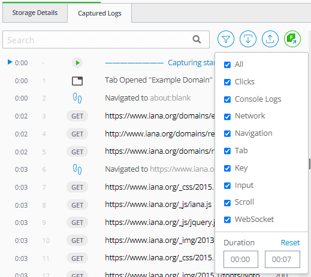

# Working With Submitted Logs

Once [an extension user](#extension-users) submits recorded traffic, the log is uploaded to the Fiddler Jam cloud space. By default, the uploaded logs will be stored for 30 days in the cloud storage, and then they will be deleted. With the Fiddler Jam portal, any [portal user](#user-role) with access rights could save, organize, analyze and work with the provided records. 

## Open Submitted Logs

After a Fiddler Jam user submits a log, the log is uploaded to the Fiddler Jam cloud space. At this moment, only this user knows the exact address of the log. The next step is for the extension user to share the generated link with other portal users (e.g., a support engineer with Fiddler Jam subscription and user role). The access rules are set via [the link generation options]().

To protect the content of the submitted log, the following rules apply:

1. The submitted log can only be opened by a portal user who meets the access rights requirements set by the extension user via [the link generation options]()).
2. Initially, the submitted log can only be opened by [**a portal user**](#user-role) . Quota restrictions apply for the portal user opening the log based on the active subscription (refer to the _Reports per month_ row in [the subscription comparison table](#subscriptions)).
3. (_Optional_) The submitted log can be added to a workspace. Logs that are not added to a workspace will be automatically deleted after 30 days. 

For [**a portal viewer**](#viewer-role) role to be able to open the submitted log, the log must be added to a workspace (by a portal user), and the extension user should have set an appropriate access level during the link generation.

## Working with Logs

Once a submitted log is opened in the Fiddler Jam portal, there are multiple functionalities that the portal UI provides like:

- [Editing log's details](#log-details) (title, description, etc.).
- [Investigating the log's captured traffic in detail (requests and responses)](#traffic-inspection). 
- [Inspecting the taken screenshots](#screenshot-inspection).
- [Analyzing the developer's console logs](#console-log-inspection).
- [Deep dive investigation through Fiddler Everywhere](#fiddler-everywhere-integration).
- [Exporting as HAR file](#export-har).
- [Adding submitted logs to organizational workspaces](#Aadd-submitted-log-to-workspace).

## Log Details

To edit the log details of a newly submitted log:

- Open the submitted log and click on **Add to Workspace**.
- In the prompted window, edit the log details (_title_, _description_, _submitted by_, _workspace_).
- Click **Done** when ready. The log will be added to the selected workspace with the new details.

To edit the details of a log that is already added in a workspace:

- Open the submitted log from the workspace.
- Click on the **Edit Log Details** icon (top-right corner next to _Open Workspace_).
- Edit the log's _title_, _description_, and _submitted by_ fields.
- Click on **Done** when ready.

## Using Logs

Depending on the selected [capture options](), a Fiddler Jam log could contain the captured traffic (sessions), screenshots, and developer's console logs.

### Traffic Inspection

Each Fiddler Jam log contains a list of captured HTTP sessions and request/response inspectors. On the left side, called **Captured Logs**, the UI provides the captured HTTP sessions, screenshots, and console logs. On the right side, called **Inspectors**, Fiddler Jam provides the **Request**, and **Response** inspectors (when an HTTP session is selected) or the screenshot/console logs preview screen (when a screenshot or a console log is selected).

To investigate a specific HTTP session:
- Open the submitted log.
- (Optional) Filter by search term (while using the Search text field) or Filter by log type (while using the Filter button)
- Select a session line. 
    - If the selected line is an HTTP session, then the **Request** and **Response** inspectors load the session content (headers, body, cookies, etc.). Note that depending on [the capture options](), some of the submitted information might be masked. 
    - If the selected line is a screenshot, a **Preview** inspector will load the taken screenshot depicting the moment of the user interaction.
    - If the selected line is a console log, a **Console Log** inspector will load the log details and stack trace.

    >tip Each captured HTTP(S) session has a unique line ID which can be used as a reference in both the Fiddler Jam portal and the Fiddler Everywhere desktop application.

>tip The traffic list and the inspectors are inspired by the Fiddler Everywhere UI. Learn more on how to use [the Request and Response inspectors](https://docs.telerik.com/fiddler-everywhere/user-guide/live-traffic/inspector-types) to investigate the captured traffic.

### Screenshot Inspection

Suppose the extension user has explicitly enabled the screenshot capturing. In that case, a Fiddler Jam log will also contain screenshot lines for each user interaction made from the extension user (while the recording is on). 

- Select a screenshot line in the Captured Logs list - the screenshot loads in a screenshot preview inspector.
- Use the **Save** icon to download the screenshot locally as a PNG file.

>tip Fiddler Jam extension will take screenshots on user interactions like following a link, pressing a button, etc.

### Console Log Inspection

If the extension user has explicitly enabled the developer's console logs capturing, a Fiddler Jam log will also contain console log lines.

- Select a console log line in the Captured Logs list - the console log loads in a custom inspector.
- Use the **Details** inspector for examining the console log.
- Use the **Stack Trace** inspector for inspection of the stack trace.

### Filters

A Fiddler Jam log could contain exsessive number of recoreded HTTP requests, screenshots, and console logs. Use the search text input to filter out all requests containing the search term within the URL or in the Request Headers. Use the **Filters** (the icon next to the search text input) to filter out the different log entries (requests, screenshots, and console logs).

### Details Inspection

Each log stores detailed technical information about its creation which could further ease the support process. Access technical details like platform, date & time when the log was recorded, Jam extension version, etc., by pressing the **MORE** option next to the log's description.

- **Name** - The name of the log as saved in the workspace
- **Submitted by** - The name of the portal user that submitted the log.
- **Description** - The custom description for the submitted log.
- **Domain** - The domain name from the captured sessions.
- **Starting URL** - The initial URL used when capturing was started by the extension user.
- **Date Time** - A timestamp when the capturing was started plus the duration of the capturing in HH:MM:SS
- **Platform** - The operating system version.
- **Jam Extension** - The version of the Fiddler Jam extension.
- **Type** - The type of the platform (for example, _Desktop_ or _Mobile_).
- **Locale** - The encoding used by the extension user.
- **Timezone** - The timezone used by the extension user.

